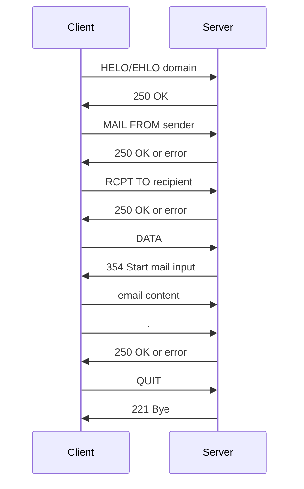

## Application Layer

### HTTP

### SMTP

```mermaid
sequenceDiagram
    participant C as Client
    participant S as Server
    C->>S: HELO/EHLO domain
    S->>C: 250 OK
    C->>S: MAIL FROM sender
    S->>C: 250 OK or error
    C->>S: RCPT TO recipient
    S->>C: 250 OK or error
    C->>S: DATA
    S->>C: 354 Start mail input
    C->>S: email content
    C->>S: .
    S->>C: 250 OK or error
    C->>S: QUIT
    S->>C: 221 Bye
```

