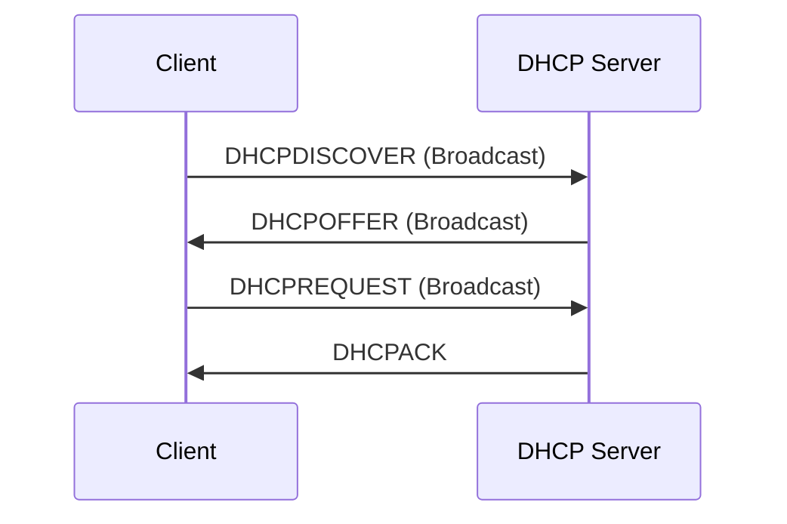

## Network Layer

### Forwarding vs. Routing

- <u>**Forwarding** is the process of moving a packet from one interface to another within a single router.</u> It is based on the destination address of the packet and the forwarding table of the router. Forwarding is a local action that does not involve any network-wide knowledge or coordination.

- <u>**Routing** is the process of finding a path from a source to a destination in a network of routers.</u> It is based on the topology of the network and the routing protocols that exchange information among routers. Routing is a global action that requires network-wide knowledge and coordination.

### Forwarding Tables

- Destination-based Forwarding: `Map<Destination, LinkInterface>`

- Longest Prefix Matching: `Map<Prefix, LinkInterface>`

### Router

```
+----------------------------------------------------+
|                     Router                         |
| +------------+  +-------------------+  +---------+ |
| | Input      |->| Switch            |->| Output  | | Data
| | Ports      |  | Fabric            |  | Ports   | | Plane
| +------------+  +--------+----------+  +---------+ | (Forwarding)
|	                         |                         |
| +------------------------+-----------------------+ |
| | Routing                                        | | Control
| | Processor                                      | | Plane
| +------------------------------------------------+ | (Routing)
+----------------------------------------------------+

```

#### Switch Fabrics

- Via memory
- Via a bus
- Via interconnection network

#### Input Port Queuing

- **Condition**: Switch fabric slower than input ports combined.
- **Head of Line (HOL) blocking**: queued datagram at front of queue prevents others in queue from moving forward.

#### Output Port Queuing

- **Buffering** required when datagrams arrive from fabric faster than link transmission rate.
  - Datagrams can be lost due to lack of buffers
- **Scheduling discipline** chooses among queued datagrams for transmission.
  - **Priority scheduling** used.

### IPv4

```
 0                   1                   2                   3  
 0 1 2 3 4 5 6 7 8 9 0 1 2 3 4 5 6 7 8 9 0 1 2 3 4 5 6 7 8 9 0 1 
+-+-+-+-+-+-+-+-+-+-+-+-+-+-+-+-+-+-+-+-+-+-+-+-+-+-+-+-+-+-+-+-+
|Version|  IHL  |Type of Service|          Total Length         |
+-+-+-+-+-+-+-+-+-+-+-+-+-+-+-+-+-+-+-+-+-+-+-+-+-+-+-+-+-+-+-+-+
|         Identification        |Flags|      Fragment Offset    |
+-+-+-+-+-+-+-+-+-+-+-+-+-+-+-+-+-+-+-+-+-+-+-+-+-+-+-+-+-+-+-+-+
|  Time to Live |    Protocol   |         Header Checksum       |
+-+-+-+-+-+-+-+-+-+-+-+-+-+-+-+-+-+-+-+-+-+-+-+-+-+-+-+-+-+-+-+-+
|                       Source Address                          |
+-+-+-+-+-+-+-+-+-+-+-+-+-+-+-+-+-+-+-+-+-+-+-+-+-+-+-+-+-+-+-+-+
|                    Destination Address                        |
+-+-+-+-+-+-+-+-+-+-+-+-+-+-+-+-+-+-+-+-+-+-+-+-+-+-+-+-+-+-+-+-+
|                    Options                    |    Padding    |
+-+-+-+-+-+-+-+-+-+-+-+-+-+-+-+-+-+-+-+-+-+-+-+-+-+-+-+-+-+-+-+-+
|                             Payload                           |
|                             ...                               |
+-+-+-+-+-+-+-+-+-+-+-+-+-+-+-+-+-+-+-+-+-+-+-+-+-+-+-+-+-+-+-+-+
```

- **Overhead**: 20 bytes (empty options), up to 60 bytes.

#### Fragmentation and Reassembly

- **MTU**: largest possible link-level frame.
- Large (> MTU) IP datagram becomes several datagrams and reassembled only at destination.

#### Subnets

- **Definition**: device interfaces on the same network to communicate with each other without going through a router.
- **CIDR**: `a.b.c.d/x`
  - **Subnet Part**: First `x` bits.
  - **Host Part**

#### DHCP

Based on UDP.



#### NAT

Translate source and destination addresses based on NAT translation table: `BiMap<WanAddr, LanAddr>`.

#### IPv6

```
 0                   1                   2                   3  
 0 1 2 3 4 5 6 7 8 9 0 1 2 3 4 5 6 7 8 9 0 1 2 3 4 5 6 7 8 9 0 1 
+-+-+-+-+-+-+-+-+-+-+-+-+-+-+-+-+-+-+-+-+-+-+-+-+-+-+-+-+-+-+-+-+
|Version| Traffic Class |           Flow Label                  |
+-+-+-+-+-+-+-+-+-+-+-+-+-+-+-+-+-+-+-+-+-+-+-+-+-+-+-+-+-+-+-+-+
|         Payload Length        |  Next Header  |   Hop Limit   |
+-+-+-+-+-+-+-+-+-+-+-+-+-+-+-+-+-+-+-+-+-+-+-+-+-+-+-+-+-+-+-+-+
|                                                               |
+                                                               +
|                                                               |
+                         Source Address                        +
|                           (128 bits)                          |
+                                                               +
|                                                               |
+-+-+-+-+-+-+-+-+-+-+-+-+-+-+-+-+-+-+-+-+-+-+-+-+-+-+-+-+-+-+-+-+
|                                                               |
+                                                               +
|                                                               |
+                      Destination Address                      +
|                           (128 bits)                          |
+                                                               +
|                                                               |
+-+-+-+-+-+-+-+-+-+-+-+-+-+-+-+-+-+-+-+-+-+-+-+-+-+-+-+-+-+-+-+-+
|                                                               |
.                                                               .
.                             Payload                           .
.                                                               .
|                                                               |
+-+-+-+-+-+-+-+-+-+-+-+-+-+-+-+-+-+-+-+-+-+-+-+-+-+-+-+-+-+-+-+-+
```

- **Overhead**: Fixed 40 bytes.

### Generalised Forwarding

- Protocols include OpenFlow.

- **Flow table**: `Map<Pattern, Action>`
- Can be used with SDN, where a remote controller installs flow table to switches.

### Autonomous Systems

#### Inter-AS

- Handled by **gateway router**.
- Uses **BGP (Border Gateway Protocol)**:
  - Advertises:
    - **Prefix** of the destination.
    - **Attributes** 
      - `AS-PATH`: `List<AS>`  which prefix advertisement has passed
      - `NEXT-HOP`: indicates specific internal-AS router to next-hop AS
  - **eBGP**: obtain subnet reachability information from <u>neighbouring ASes</u>.
  - **iBGP**: propagate reachability information to all <u>AS-internal routers</u>.

#### Intra-AS

- Common protocols:
  - **RIP (Routing Information Protocol)**
  - **EIGRP: (Enhanced Interior Gateway Routing Protocol)**
  - **OSPF: Open Shortest Path First**: uses a link-state database to build a topology map of the network and then runs the Dijkstra algorithm to find the shortest path to each node.